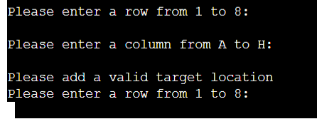

# Portfolio Project 3: Python Battleships
Author: *James Glennon*

---
## How to play:
The game is based of the popular boardgame [Battle Ships](https://en.wikipedia.org/wiki/Battleship_(game)).
Traditionally, the game is played 1 vs 1, however in this game only the user is attacking the computer players ships.
The user has a limited number of turns to find 5 single tile ships out of a total of 64 tile locations.
The play wins if all ships are destoryed in the turn limit.

## Features:

- random board generation:
    the computer randomly selects where to place it's battleships.

- accepts user input: the user can specify the row and column, and will be informed if their choices are invalid.

- prompts the player to play again without exiting the program

## Testing:

The program was tested by manually by imputting invalid data to all input prompts.

### Resolved bugs

- blank entries for guess values;
a series of try except statements are used to avoid game crashing errors from occuring in response to 'blank' entries.
    - a ValueError, should both row and column be left blank

    - a KeyError, should one but not the other entry be left blank

    - and an IndexError, should a value of conscutive numbers be given for row (e.g 23, 45, etc.)

### Unresolved bugs

- An entry submitted by the user is sometimes ignored, especially after the code identifies an error with the previous entry.
- The program simply prompts the user to guess again without processing the previous guess.
- I don't know why this occurs.

### Validator not found

- after searching for a validator at [PEP8 online](https://pep8online.com/) I could find no site,
and was instead redirected to [A supicious-looking site](http://ww7.pep8online.com/) which appeared to be a collection of search engine results rather than a validator.

- Another validator, [Python Checker](https://www.pythonchecker.com/), did not recognise my code as python at all, grading it at 0%. Despite this, the code runs in both Gitpod and Heroku.

## Deployment

- The code for this project was written in Gitpod, using the Code Institute python template.
- Edits were made and tested in the gitpod terminal.
- Changes were then commited and pushed to the main branch, hosted at GitHub.
- The GitHub repository was linked to Heroku.
- The main branch was then deployed to the heroku terminal, where the live site is currently.

### Abandoned idea

- Early in development, I intended to link the BOARD objects to update a google worksheet, so that a game could be paused and resumed later. This proved to be ineffective as the delay in updating the sheet resulted in the players guesses being displayed on a one turn 'delay'.

## References
*No media references for this project*

### Code

The concept was one of the suggested concepts provided by code institute.

The layout of this Readme.md is heavily based on the example provided by code institute.

This code was written closely following the step-by-step instruction found at (Youtube)[https://www.youtube.com/watch?v=tF1WRCrd_HQ],
published by (Knowledge Mavens)[https://www.youtube.com/c/KnowledgeMavens1]

The try/except functions were written following examples from code institute instructional material.

This read my file was written using [The Markdown Guide Cheat Sheet](https://www.markdownguide.org/cheat-sheet/) for synthax.